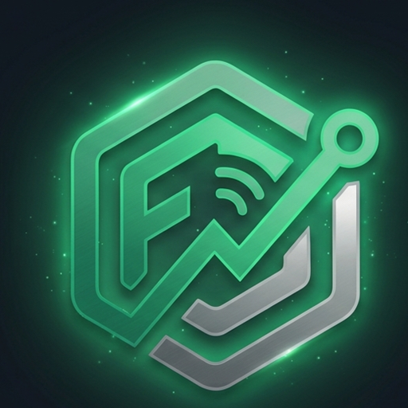
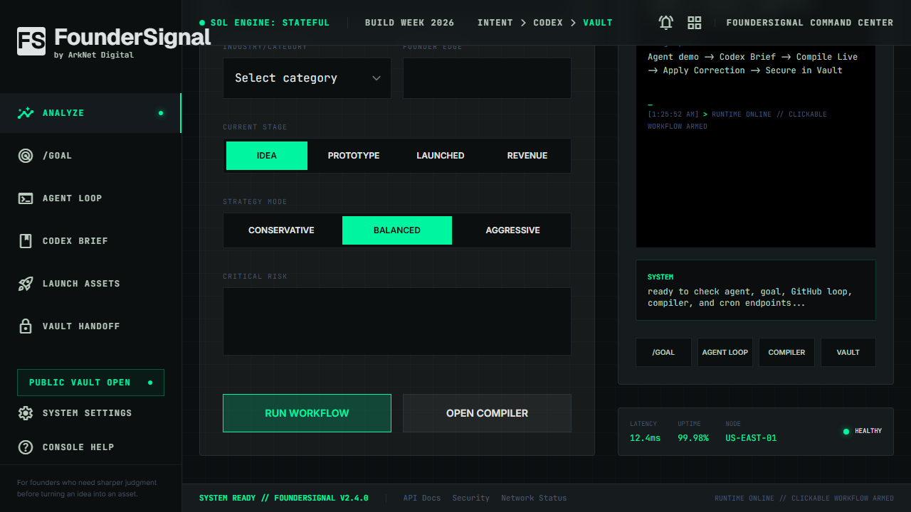
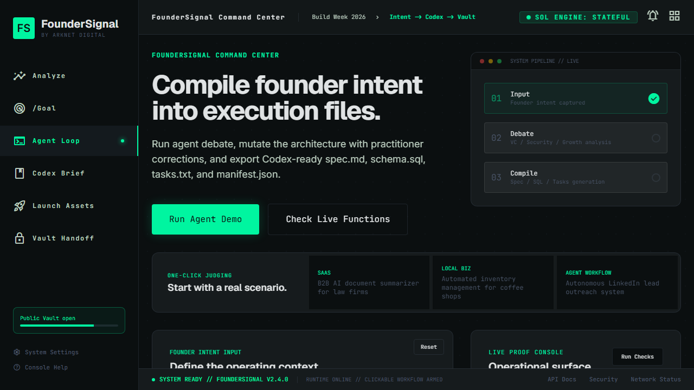
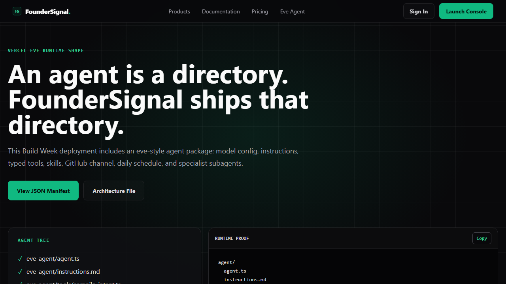
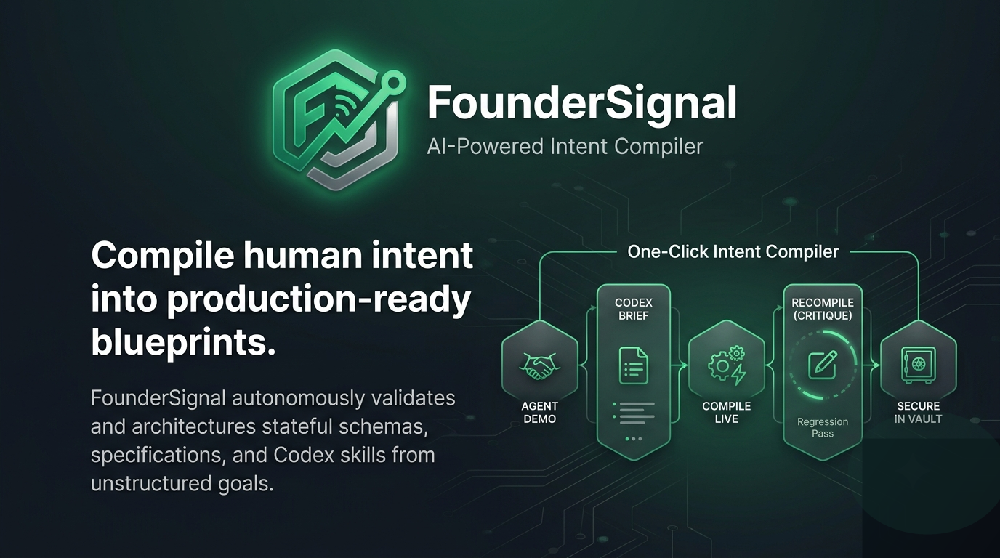
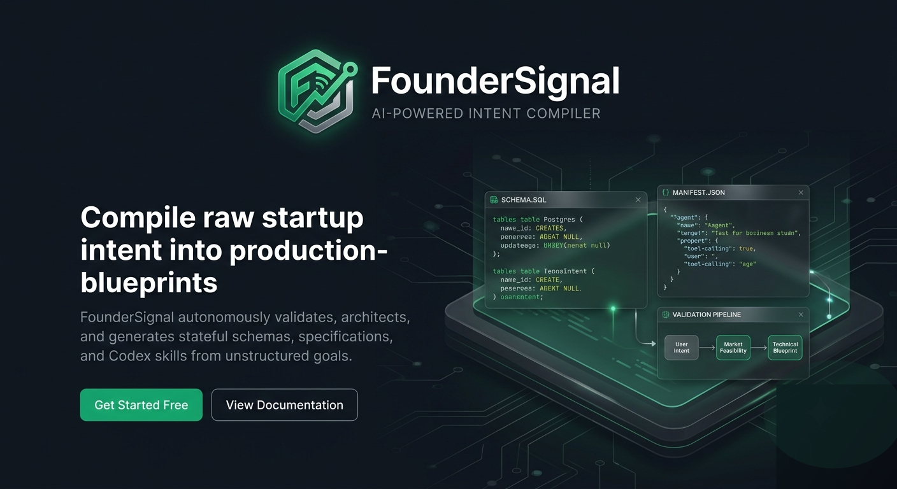

<div align="center">

# FounderSignal

### Autonomous Idea-to-Execution Compiler

FounderSignal turns raw founder intent into Codex-ready execution packets: agent confrontation, corrected specs, Supabase RLS schemas, task lists, reusable manifests, GitHub packets, eve agent files, and Vault handoff packages.

<p>
  <a href="https://foundersignal-buildweek.vercel.app/"></a>
  <a href="https://github.com/jayblast-spec/FounderSignal"></a>
  <a href="https://foundersignal-buildweek.vercel.app/api/system-status"></a>
</p>

<p>
  
</p>

<p>
  
  
  
  
  
  
  
</p>

<p>
  
</p>

<p>
  
</p>

</div>

## Visual Preview

<table>
  <tr>
    <td width="33%">
      
      <br>
      <sub><strong>01 / Live Product</strong> - command-layer landing experience</sub>
    </td>
    <td width="33%">
      
      <br>
      <sub><strong>02 / Codex Brief</strong> - spec, schema, tasks, manifest</sub>
    </td>
    <td width="33%">
      
      <br>
      <sub><strong>03 / eve Agent</strong> - tools, skills, schedules, subagents</sub>
    </td>
  </tr>
</table>

<p align="center">
  
</p>

## Brand Heroes

<table>
  <tr>
    <td width="50%"></td>
    <td width="50%"></td>
  </tr>
</table>

## Live Links

| Surface | URL | Purpose |
|---|---|---|
| Live product | https://foundersignal-buildweek.vercel.app/ | Public Build Week experience |
| 90 Sec Demo | https://foundersignal-buildweek.vercel.app/demo.html | Guided judge walkthrough |
| Devpost Copy | https://foundersignal-buildweek.vercel.app/DEVPOST_COPY.md | Short submission-ready copy block |
| Agent Console | https://foundersignal-buildweek.vercel.app/report.html | Run VC, security, and growth confrontation |
| Codex Brief | https://foundersignal-buildweek.vercel.app/brief.html | Compile `spec.md`, `schema.sql`, `tasks.txt`, `manifest.json` |
| Launch Assets | https://foundersignal-buildweek.vercel.app/assets.html | Generate GitHub implementation packets |
| Product: Agent Console | https://foundersignal-buildweek.vercel.app/products/agent-console/ | Product page for the confrontation surface |
| Product: GitHub Loop | https://foundersignal-buildweek.vercel.app/products/github-loop/ | Product page for implementation issue packets |
| Product: Vault Continuity | https://foundersignal-buildweek.vercel.app/products/vault-continuity/ | Product page for session handoff |
| Builder Proof | https://foundersignal-buildweek.vercel.app/builder.html | Inspect the live system, repo, and proof surfaces |
| Repository Skill | https://foundersignal-buildweek.vercel.app/documentation/repository/ | Use FounderSignal as a Codex workflow |
| eve Agent | https://foundersignal-buildweek.vercel.app/eve/ | Durable agent directory proof |
| Vault Handoff | https://foundersignal-buildweek.vercel.app/vault-handoff.html | Package corrected session for continuity |
| Workspace Packet | https://foundersignal-buildweek.vercel.app/workspace.html | Copy-ready handoff for Codex, GPT, and vibe coders |
| Changelog | https://foundersignal-buildweek.vercel.app/resources/changelog/ | Product update log |
| Resource Status | https://foundersignal-buildweek.vercel.app/resources/status/ | Human-readable status page |
| Community | https://foundersignal-buildweek.vercel.app/resources/community/ | Clone, test, correct, and reuse path |
| Proof Scenarios | https://foundersignal-buildweek.vercel.app/resources/customer-stories/ | SaaS, local business, and agent workflow scenarios |
| System Status | https://foundersignal-buildweek.vercel.app/api/system-status | Verified route/artifact/cron contract |

## What FounderSignal Does

FounderSignal is not a chat wrapper. It is an execution compiler for founder workflows.

```text
Founder intent
  -> Specialist confrontation
  -> Codex-ready brief
  -> Correction loop
  -> Supabase RLS schema
  -> Workspace packet
  -> GitHub issue packet
  -> eve-compatible skill files
  -> Vault handoff package
```

Expected result: a vague startup idea becomes a machine-parsable implementation packet a developer or Codex agent can act on.

## Command Layer

FounderSignal positions Codex as the orchestration layer and treats other engines as supporting surfaces.

| Layer | Logo | Role |
|---|---:|---|
| OpenAI Codex |  | System orchestration, repo-ready artifacts, correction memory, task boundaries, implementation handoff |
| Groq |  | Fast specialist confrontation and public demo inference |
| Gemini |  | Optional research or multimodal reasoning surface |
| NVIDIA |  | Optional local or edge acceleration layer |
| Vercel |  | Functions, cron, deployment, and eve-style agent runtime shape |
| Supabase |  | PostgreSQL schema, explicit RLS, and future persistence |
| GitHub |  | Issue templates, PR template, eval workflow, and implementation queue |

No unsupported benchmark claims are made. The point is architecture: other engines can assist; Codex receives the corrected implementation packet.

## Build Week Workflow

| Step | Icon | Route | Output |
|---:|---|---|---|
| 01 | `AI` | `/report.html` | VC, security, and growth agents pressure-test the idea |
| 02 |  | `/brief.html` | Codex brief with spec/schema/tasks/manifest |
| 03 | `RC` | `/brief.html` | Founder correction becomes a regression check |
| 04 |  | `/documentation/repository/` | Reusable Codex Skill instructions |
| 05 |  | `/eve/` | eve-style agent directory proof |
| 06 | `VA` | `/vault-handoff.html` | Corrected artifact state packaged for Vault continuity |

## Core Capabilities

| Capability | Icon | What It Proves |
|---|---|---|
| Validation Engine | `VE` | Agentic regression framework that verifies artifacts against founder intent |
| Codex Compiler |  | Blueprint compilation into markdown, SQL, task lists, and manifests |
| Recursive Repair | `RR` | Corrections mutate the artifact set instead of generating loose new answers |
| GitHub Loop |  | Implementation issue packets for a real engineering queue |
| Supabase-safe |  | PostgreSQL schema with explicit RLS policies |
| Vercel eve Agent |  | Agent directory with tools, skills, schedules, channels, and subagents |

## What It Generates

| Artifact | Format | Purpose |
|---|---|---|
| `spec.md` | Markdown | Functional requirements, constraints, workflows |
| `schema.sql` | Supabase PostgreSQL | Tables, relations, indexes, explicit RLS policies |
| `tasks.txt` | Markdown checklist | Atomic Codex `/goal` implementation tasks |
| `manifest.json` | JSON | Reusable Codex Skill manifest |
| `AGENTS.md` block | Markdown | Repo-ready agent operating instructions |
| Workspace Packet | Markdown + prompt | Copy-ready `/goal`, acceptance criteria, target files, and guardrails |
| GitHub issue packet | JSON/Markdown | Issue title, labels, body, checklist |
| Vault package | Markdown + hash | Corrected session handoff for ArkNet Digital Vault reference |

## Judge Walkthrough

Use this sequence to verify the full loop:

1. Open https://foundersignal-buildweek.vercel.app/demo.html
2. Click **Start at Agent Console**.
3. Select **Agent Mission**, **SaaS Mission**, or **Local Biz Mission**.
4. Click **Run Workflow**.
5. Watch the processing runtime install sequence.
6. Inspect `CYNICAL VC`, `SECURITY ARCHITECT`, and `GROWTH OPERATOR` cards.
7. Open **Codex Brief**.
8. Click **Compile Live**.
9. Inspect `SPEC.MD`, `SCHEMA.SQL`, `TASKS.TXT`, and `MANIFEST.JSON`.
10. Add a founder correction, then click **Apply Correction**.
11. Verify the corrected artifacts update in place.
12. Open **Workspace Packet**.
13. Click **Generate Workspace Packet** and copy the `/goal` handoff.
14. Open **Launch Assets**.
15. Click **Generate GitHub Packet**.
16. Open **Live Checks** and click **Run Checks**.
17. Open **Vault Handoff**.
18. Click **Commit Assets** and verify a `SESSION_...` id.

## API Surface

| Method | Endpoint | Purpose |
|---|---|---|
| `POST` | `/api/agent-confrontation` | Runs VC, security, and growth specialist confrontation |
| `POST` | `/api/goal-execution` | Converts a target into staged execution |
| `POST` | `/api/compile-brief` | Generates `spec`, `schema`, `tasks`, and `manifest` |
| `POST` | `/api/refine-artifacts` | Applies founder correction and returns updated artifacts |
| `POST` | `/api/github-loop` | Produces GitHub implementation issue packet |
| `POST` | `/api/vault-commit` | Creates session id and content hash |
| `POST` | `/api/workspace-packet` | Generates a `/goal`, acceptance criteria, target files, guardrails, and copy-ready prompt |
| `GET` | `/api/eve-manifest` | Shows eve-style agent directory contract |
| `GET` | `/api/cron/founder-signal-check` | Daily signal review hook |
| `GET` | `/api/system-status` | Live deployment contract counts |

Example:

```bash
curl -X POST https://foundersignal-buildweek.vercel.app/api/compile-brief \
  -H "Content-Type: application/json" \
  -d '{"idea":"Multi-agent LinkedIn lead outreach system","score":82,"risks":["platform policy","deliverability","personalization quality"]}'
```

## Use FounderSignal as a Codex Skill

FounderSignal can be used as a reusable Codex workflow, not only as a hosted demo.

1. Copy `AGENTS.md` into a Codex project or thread.
2. Use `eve-agent/skills/startup-validation.md` as the validation skill.
3. Use `eve-agent/skills/supabase-rls.md` for database/RLS generation.
4. Use `eve-agent/tools/compile_intent.ts` as the compile tool contract.
5. Use the generated `manifest.json` tab as the portable skill descriptor.

Minimal invocation:

```json
{
  "founder_intent": "B2B AI document summarizer for law firms",
  "agent_validation_score": 84,
  "critical_risks": ["data privacy", "multi-tenant isolation", "workflow adoption"],
  "founder_corrections": ["Must support firm-level data isolation"],
  "outputs": ["spec.md", "schema.sql", "tasks.txt", "manifest.json"]
}
```

## eve Agent Directory

```text
eve-agent/
  agent.ts
  instructions.md
  tools/
    compile_intent.ts
    create_github_issue_packet.ts
    commit_vault_handoff.ts
  skills/
    startup-validation.md
    supabase-rls.md
  channels/
    github.ts
  schedules/
    daily-signal-check.md
  subagents/
    security-reviewer/
    growth-operator/
```

Live proof:

```bash
curl https://foundersignal-buildweek.vercel.app/api/eve-manifest
```

## GitHub Proof Assets

| File | Purpose |
|---|---|
| `.github/ISSUE_TEMPLATE/foundersignal-compile.yml` | Structured compile issue intake |
| `.github/pull_request_template.md` | PR checklist for artifact changes |
| `.github/workflows/foundersignal-agent-evals.yml` | Lightweight agent eval workflow |
| `GITHUB_INTEGRATION.md` | GitHub loop architecture |
| `SYSTEM_ARCHITECTURE.md` | End-to-end system proof |
| `SUBMISSION.md` | Devpost narrative and verification path |
| `DEVPOST_COPY.md` | Short copy block for the official submission form |

## Security Guardrails

- Generated database artifacts target Supabase PostgreSQL primitives.
- Every generated table must include `enable row level security`.
- RLS policies are emitted explicitly for read, insert, update, and delete where applicable.
- Credential-dependent AI work stays behind environment variables and deterministic fallbacks.
- Public metrics are limited to verifiable proof points, not fake volume or SLA claims.
- ArkNet Digital Vault is referenced as a public handoff layer; this repo does not write into ArkNet OS or the arknet.digital project.

## Local Development

Optional:

```bash
GROQ_API_KEY=...
```

Run locally:

```bash
npx vercel dev
```

Deploy:

```bash
npx vercel deploy --prod
```

## File Map

```text
index.html                         Product shell and live playground
platform.css                       Shared UI system, syntax colors, logo cards
platform.js                        Copy buttons and code syntax highlighting
foundersignal-runtime.js           Workflow, compile, refine, vault, checks
api/compile-brief.js               Artifact compiler endpoint
api/refine-artifacts.js            Correction and regression endpoint
api/github-loop.js                 GitHub issue packet endpoint
api/vault-commit.js                Vault handoff endpoint
api/eve-manifest.js                eve agent manifest endpoint
api/system-status.js               Verified deployment contract endpoint
eve-agent/                         eve-style agent source
AGENTS.md                          Codex operating instructions
SYSTEM_ARCHITECTURE.md             Technical architecture proof
SUBMISSION.md                      Devpost narrative and judge walkthrough
```

## Build Week Position

FounderSignal compresses the idea-to-execution gap. It lets a founder describe a business system once, then produces the materials a developer or Codex agent needs to begin implementation with clear constraints, database security, task order, and correction history.

The project demonstrates useful intelligence by turning uncertainty into finished materials.
